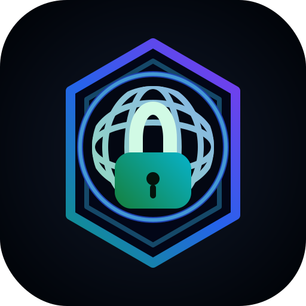
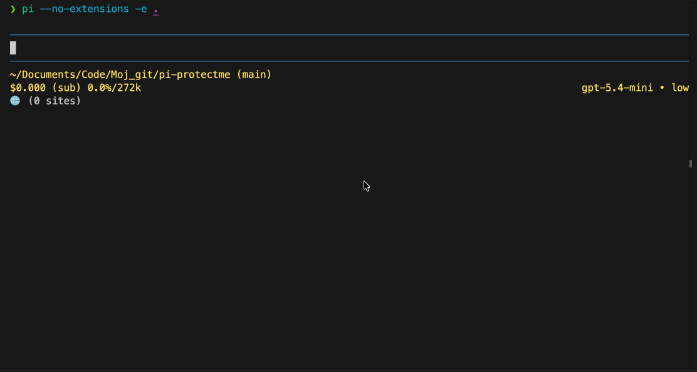

<p align="center">
  
</p>

<p align="center">
  <a href="https://pi.dev"></a>
  <a href="https://www.npmjs.com/package/@senad-d/protectme"></a>
  <a href="LICENSE"></a>
  <a href="https://sonarcloud.io/summary/new_code?id=senad-d_ProtectMe"></a>
</p>

<p align="center">
  Network access guardrails for <a href="https://pi.dev">pi</a>.
  <br />Let agents and direct Pi bash commands reach only approved network destinations from the terminal.
</p>

---

ProtectMe is a Pi extension for coding agents. It guards supported shell-network requests made by Pi agents or direct `!`/`!!` user bash commands, checks destinations against global and project allow lists, and blocks disallowed hosts before execution.

<table align="center">
  <tr>
    <th>ProtectMe demo</th>
  </tr>
  <tr>
    <td align="center">
      
    </td>
  </tr>
</table>

- **Network guard boundary:** covers supported `curl`, `wget`, `http`, and `https` invocations from Pi agent `bash` calls and Pi user bash commands.
- **Allow-list policy:** default `block` mode permits a small developer starter list and denies other unknown hosts; `allow` mode is available as an explicit temporary bypass.
- **Project-aware configuration:** trusted project config can extend global allow lists and override mode.
- **Prompted approvals:** repeated blocked hosts can be allowed once or added to a user-selected project/global config when Pi UI confirmation is available.
- **Secret-aware logging:** blocked-attempt logs are local, bounded, and redact common credential-bearing command fragments.

> **Security:** pi packages run with your full system permissions. ProtectMe is a guardrail for supported Pi command flows, not a sandbox, firewall, or proxy. Read [`SECURITY.md`](SECURITY.md).

## Table of Contents

- [Quick Start](#quick-start)
- [Installation](#installation)
- [Configuration](#configuration)
- [Commands and Tools](#commands-and-tools)
- [Troubleshooting](#troubleshooting)
- [Development and Validation](#development-and-validation)
- [Update and Uninstall](#update-and-uninstall)
- [Publishing](#publishing)
- [License](#license)

---

## Quick Start

```bash
pi install npm:@senad-d/protectme
```

Review the built-in starter allow list and add any narrow project-specific hosts as shown in [Configuration](#configuration), then start pi:

```bash
pi
```

Open the ProtectMe panel:

```text
/protectme
```

Try a guarded request through Pi:

```text
Ask the agent to run curl https://example.com only if ProtectMe allows the host; otherwise explain the block.
```

ProtectMe guards supported request-making shell commands. It does not run scanners, make network calls itself, or require API credentials.

---

## Installation

| Scope | Command | Notes |
| --- | --- | --- |
| Global | `pi install npm:@senad-d/protectme` | Loads in every trusted pi project. |
| Project-local | `pi install npm:@senad-d/protectme -l` | Writes to `.pi/settings.json` in the current project. |
| One run | `pi -e npm:@senad-d/protectme` | Try without changing settings. |
| Git | `pi install git:github.com/senad-d/ProtectMe@<tag>` | Pin a tag or commit. |
| Local checkout | `pi --no-extensions -e .` | Develop or smoke-test this repository in isolation. |

Source checkout:

```bash
git clone https://github.com/senad-d/ProtectMe.git
cd ProtectMe
npm ci
npm run validate
pi --no-extensions -e .
```

---

## Configuration

ProtectMe reads JSON config from global and project-local files. It does not require secrets. On runtime load, it creates a missing global config at `~/.pi/agent/protectme.json` with the built-in defaults; project config is still only written when you explicitly confirm a `/protectme` edit or repeated-block prompt.

| Scope | Path | Notes |
| --- | --- | --- |
| Global | `~/.pi/agent/protectme.json` | Applies across projects. `PI_CODING_AGENT_DIR` moves this path in standard Pi installations. |
| Project | `.pi/protectme.json` | Applies only when Pi reports the project as trusted. |
| Block log | `.pi/agent/protectme_log.jsonl` | Append-only local log for blocked attempts. Allowed requests are not logged. |

Schema:

```json
{
  "mode": "block",
  "allowList": ["example.com", "api.example2.com"]
}
```

Fields:

| Field | Required | Meaning |
| --- | --- | --- |
| `mode` | No | `"block"` blocks disallowed hosts. `"allow"` permits detected requests without prompts or blocked-attempt logs. |
| `allowList` | No | Host entries allowed in `block` mode. Entries are normalized and deduplicated. |

A missing global config is initialized automatically with `mode: "block"` and this built-in starter allow list:

```json
{
  "mode": "block",
  "allowList": [
    "localhost",
    "127.0.0.1",
    "::1",
    "pi.dev",
    "github.com",
    "npmjs.com",
    "registry.npmjs.org",
    "nodejs.org"
  ]
}
```

Resolution order:

- Built-in starter entries load first.
- Global config appends additional `allowList` entries.
- Trusted project config appends additional `allowList` entries.
- Trusted project `mode` overrides global `mode` when present.
- Untrusted project config is ignored without reading project-local contents.
- Invalid or unreadable loaded config fails closed with `mode: "block"` and an empty effective allow list.

Host matching rules:

- `example.com` allows `example.com`, paths on that host, and child subdomains such as `api.example.com`.
- `api.example2.com` allows itself and child subdomains, but not parent domain `example2.com`.
- Public suffix entries such as `com` or `co.uk` are ignored and reported as warnings.
- Single-label non-localhost entries such as `internal-service` match only that exact host.
- `localhost`, IPv4, and IPv6 entries match exactly, including ports such as `localhost:3000`.
- Local subdomains such as `app.localhost` are not covered by `localhost`; add `app.localhost` or another exact local hostname to your project allow list when needed.

Blocked-attempt log retention:

- `.pi/agent/protectme_log.jsonl` is append-only local state for blocked attempts.
- ProtectMe reads recent entries with a bounded tail window and does not compact, upload, or delete the log.
- Delete or truncate `.pi/agent/protectme_log.jsonl` if you want to clear local history.

---

## Commands and Tools

| Surface | Name | Use it for |
| --- | --- | --- |
| Command | `/protectme` | Inspect effective config, edit project settings, and view recent blocked hosts in Pi TUI mode. |
| Event guard | `tool_call` | Block unsupported destinations in agent `bash` tool calls before execution. |
| Event guard | `user_bash` | Block unsupported destinations in direct Pi `!`/`!!` user bash commands before execution. |
| Custom tools | None | ProtectMe is event-based and does not register agent tools. |

Guarded request CLIs:

- `curl`
- `wget`
- `http`
- `https`

ProtectMe also inspects approved non-network wrappers such as `sudo`, `env`, `time`, `timeout`, and `nice` when they launch a supported request CLI. URL-bearing proxy and resolver options are treated as additional destinations. Static option sources that can hide destinations, such as `curl --config` or `wget --input-file`, fail closed.

Suggested workflow:

1. Start with `/protectme` to inspect mode, trust status, and allow-list counts.
2. Keep `mode` as `block` and add only the narrow project-specific hosts you need, such as `app.localhost` for local subdomain testing.
3. Let the agent or direct Pi `!`/`!!` commands run supported request CLIs normally.
4. Review repeated-block prompts carefully before allowing once or choosing which config file receives a saved allow-list entry.

---

## Troubleshooting

| Problem | Try |
| --- | --- |
| Unexpected block | Run `/protectme`, inspect mode and counts, then add the intended host to project config or global config. |
| Config warning | Fix invalid JSON, schema errors, unreadable files, or ignored invalid allow-list entries. |
| Project config ignored | Trust the project in Pi or use global config. ProtectMe does not read untrusted `.pi/protectme.json`. |
| Prompt unavailable | Use Pi TUI mode for confirmation prompts, or edit config manually. Repeated attempts fail closed without UI confirmation. |
| Direct shell command was not blocked | Run commands through Pi `!`/`!!`; commands outside Pi are outside ProtectMe's boundary. |
| Unsupported CLI was not blocked | ProtectMe v1 covers `curl`, `wget`, `http`, and `https`; use OS/container controls for other network tools. |
| Need a temporary bypass | Set project config to `{ "mode": "allow" }`, then switch back to `block` when finished. |
| Want a clean smoke test | Run `pi --no-extensions -e .` from this repository. |

---

## Development and Validation

```bash
npm ci
npm run typecheck
npm run lint
npm run format:check
npm run test
npm run test:coverage
npm run check:pack
npm run validate
```

Isolated interactive smoke test:

```bash
pi --no-extensions -e .
```

`npm run validate` includes type checking, ESLint, formatting checks, script syntax checks, automated tests, and package dry-run validation. CI runs the same validation chain.

Project docs:

- [`docs/STRUCTURE.md`](docs/STRUCTURE.md) — repository layout and runtime boundaries.
- [`docs/manual-smoke-test.md`](docs/manual-smoke-test.md) — isolated Pi smoke-test checklist.
- [`docs/configuration-tui-design-standard.md`](docs/configuration-tui-design-standard.md) — `/protectme` TUI design standard.
- [`specs/spec-protectme-architecture.md`](specs/spec-protectme-architecture.md) — architecture plan.
- [`specs/spec-protectme-guidelines.md`](specs/spec-protectme-guidelines.md) — implementation guidelines.
- [`specs/spec-protectme-tasks.md`](specs/spec-protectme-tasks.md) — implementation task list.

---

## Update and Uninstall

```bash
pi update --extensions                    # update installed pi packages
pi update npm:@senad-d/protectme          # update ProtectMe only
pi remove npm:@senad-d/protectme          # remove global install
pi remove npm:@senad-d/protectme -l       # remove project-local install
```

---

## Publishing

ProtectMe publishes to npm as `@senad-d/protectme`.

```bash
npm login
npm whoami
node scripts/publish-npm.mjs
```

Run the publish script only from a clean working tree after updating `CHANGELOG.md`.

---

## License

MIT
